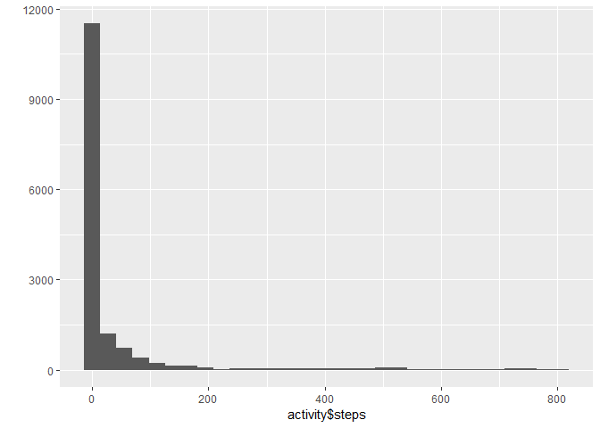
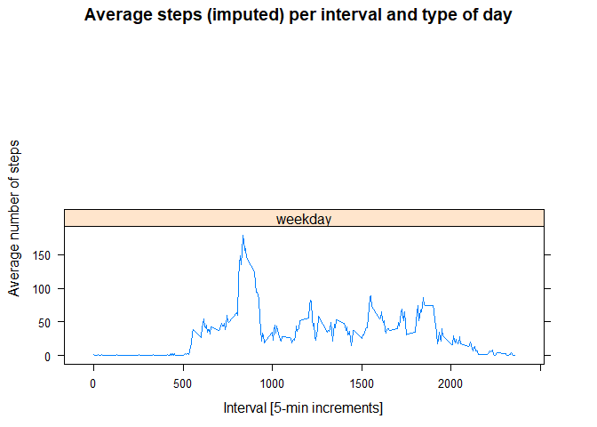

## Loading and preprocessing the data

```r
library(readr)
library(ggplot2)
activity <- read_csv("activity.csv")
```

```
## Parsed with column specification:
## cols(
##   steps = col_integer(),
##   date = col_date(format = ""),
##   interval = col_integer()
## )
```


## What is mean total number of steps taken per day?

```r
mean(activity$steps, na.rm = T)  
```

```
## [1] 37.3826
```

```r
median(activity$steps, na.rm = T)  
```

```
## [1] 0
```

```r
qplot(activity$steps, geom="histogram") 
```

```
## `stat_bin()` using `bins = 30`. Pick better value with `binwidth`.
```

```
## Warning: Removed 2304 rows containing non-finite values (stat_bin).
```

<!-- -->

## What is the average daily activity pattern?

```r
averages <- aggregate(x=list(steps=activity$steps), by=list(interval=activity$interval),
                      FUN=mean, na.rm=TRUE)
ggplot(data=averages, aes(x=interval, y=steps)) +
    geom_line() +
    xlab("5-minute interval") +
    ylab("average number of steps taken")
```

<!-- -->


```r
averages[which.max(averages$steps),]
```

```
##     interval    steps
## 104      835 206.1698
```

## Imputing missing values


```r
sum(is.na(activity$steps))
```

```
## [1] 2304
```

```r
activity_no_na <- activity
activity_no_na[is.na(activity_no_na)] <- 0 
```

## Are there differences in activity patterns between weekdays and weekends?


```r
DayCategory <- function(date) {
    if (weekdays(date) %in% c("Saturday", "Sunday")) {
        "weekend"
    } else {
        "weekday"
    }
}

activity_no_na$DayCat <- as.factor(sapply(activity_no_na$date, DayCategory))
```


```r
library(plyr)

ImputedStepsPerIntervalDayCat <- ddply(activity_no_na,.(interval,DayCat),summarize,AverageSteps=mean(steps))

library(lattice)

xyplot(AverageSteps~interval|DayCat,data=ImputedStepsPerIntervalDayCat,type="l",layout = c(1,2),
       main="Average steps (imputed) per interval and type of day",
       ylab="Average number of steps",xlab="Interval [5-min increments]")
```

<!-- -->

